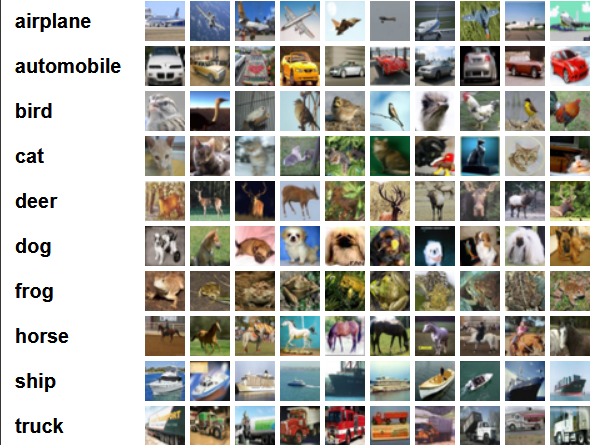

# 使用深度学习对 CIFAR-10 进行分类

### 实验目的

使用机器学习和深度学习方法对 CIFAR-10 数据集进行分析，针对不同的方法进行分析、测试。

### 实验说明

本次实验深度学习的方法使用了：全连接神经网络、循环神经网络和卷积神经网络分别构建模型从`CIFAR-10`数据集进行训练和测试。同时使用了机器学习的逻辑斯谛回归(Logistic Regression)，同样针对`CIFAR-10`数据集进行训练和测试。
`CIFAR-10`数据集中共包含 50000 张训练图片和 10000 张测试图片，共 10 个类别，分别是：_airplane_, _automobile_, _bird_, _cat_, _dog_, _frog_, _horse_, _ship_, _truck_。
图像大小为$32×32$的彩色 RGB 图片，如图：


### 实验步骤

1. 加载训练集
2. 使用`transforms`对数据进行预处理
3. 定义神经网络模型
4. 使用定义的网络模型进行训练
5. 对训练好的模型进行测试，测试模型的整体准确性和针对不同类型的准确性。


### 模型构建

#### 卷积神经网络

构建卷积神经网络模型，使用多层次的$卷积层+池化层$。
这里模仿了 VGG 的网络模型，使用了多个$3\times3$的卷积核。经检验，这样的模型的识别效果表现还不错。
| Input（32×32×3）color image|
|:----:|
|Conv1 3×3, 64|
|Conv2 3×3, 64|
|Maxpool 2×2, strides = 2|
|Batch Normalization|
|Relu|
|-|
|Conv3 3×3, 128|
|Conv4 3×3, 128|
|Maxpool 2×2, strides = 2|
|Batch Normalization|
|Relu|
|-|
|Conv5 3×3, 128|
|Conv6 3×3, 128|
|Conv7 1×1, 128|
|Maxpool 2×2, strides = 2|
|Batch Normalization|
|Relu|
|-|
|Conv8 3×3, 256|
|Conv9 3×3, 256|
|Conv10 1×1, 256|
|Maxpool 2×2, strides = 2|
|Batch Normalization|
|Relu|
|-|
|Conv11 3×3, 512|
|Conv12 3×3, 512|
|Conv13 1×1, 512|
|Maxpool 2×2, strides = 2|
|Batch Normalization|
|Relu|
|-|
|FC14 (8192, 1024)|
|Dropout|
|Relu|
|FC15 (1024, 1024)|
|Dropout|
|Relu|
|FC16 (1024, 10)|

```python
class Net(nn.Module):

    def __init__(self, trainloader, testloader):
        super(Net, self).__init__()
        self.trainloader = trainloader
        self.testloader = testloader

        self.conv1 = nn.Conv2d(3, 64, 3, padding=1)
        self.conv2 = nn.Conv2d(64, 64, 3, padding=1)
        self.pool1 = nn.MaxPool2d(2, 2)
        self.bn1 = nn.BatchNorm2d(64)
        self.relu1 = nn.ReLU()

        self.conv3 = nn.Conv2d(64, 128, 3, padding=1)
        self.conv4 = nn.Conv2d(128, 128, 3, padding=1)
        self.pool2 = nn.MaxPool2d(2, 2, padding=1)
        self.bn2 = nn.BatchNorm2d(128)
        self.relu2 = nn.ReLU()

        self.conv5 = nn.Conv2d(128, 128, 3, padding=1)
        self.conv6 = nn.Conv2d(128, 128, 3, padding=1)
        self.conv7 = nn.Conv2d(128, 128, 1, padding=1)
        self.pool3 = nn.MaxPool2d(2, 2, padding=1)
        self.bn3 = nn.BatchNorm2d(128)
        self.relu3 = nn.ReLU()

        self.conv8 = nn.Conv2d(128, 256, 3, padding=1)
        self.conv9 = nn.Conv2d(256, 256, 3, padding=1)
        self.conv10 = nn.Conv2d(256, 256, 1, padding=1)
        self.pool4 = nn.MaxPool2d(2, 2, padding=1)
        self.bn4 = nn.BatchNorm2d(256)
        self.relu4 = nn.ReLU()

        self.conv11 = nn.Conv2d(256, 512, 3, padding=1)
        self.conv12 = nn.Conv2d(512, 512, 3, padding=1)
        self.conv13 = nn.Conv2d(512, 512, 1, padding=1)
        self.pool5 = nn.MaxPool2d(2, 2, padding=1)
        self.bn5 = nn.BatchNorm2d(512)
        self.relu5 = nn.ReLU()

        self.fc14 = nn.Linear(512*4*4, 1024)
        self.drop1 = nn.Dropout2d()
        self.fc15 = nn.Linear(1024, 1024)
        self.drop2 = nn.Dropout2d()
        self.fc16 = nn.Linear(1024, 10)

    def forward(self, x):
        x = self.conv1(x)
        x = self.conv2(x)
        x = self.pool1(x)
        x = self.bn1(x)
        x = self.relu1(x)

        x = self.conv3(x)
        x = self.conv4(x)
        x = self.pool2(x)
        x = self.bn2(x)
        x = self.relu2(x)

        x = self.conv5(x)
        x = self.conv6(x)
        x = self.conv7(x)
        x = self.pool3(x)
        x = self.bn3(x)
        x = self.relu3(x)

        x = self.conv8(x)
        x = self.conv9(x)
        x = self.conv10(x)
        x = self.pool4(x)
        x = self.bn4(x)
        x = self.relu4(x)

        x = self.conv11(x)
        x = self.conv12(x)
        x = self.conv13(x)
        x = self.pool5(x)
        x = self.bn5(x)
        x = self.relu5(x)
        # print(" x shape ",x.size())
        x = x.view(-1, 512*4*4)
        x = F.relu(self.fc14(x))
        x = self.drop1(x)
        x = F.relu(self.fc15(x))
        x = self.drop2(x)
        x = self.fc16(x)

        return x
```

#### 全连接神经网络

全连接神经网络设计了 8 层全连接层，将原来的$32\times32\times3$的数据逐步降维，最终分为 10 类。
| Input（32×32×3）color image|
|:----:|
|Linear $32\times32\times3$, $32\times32$|
|Linear $32\times32$, $512$|
|Linear $512$, $256$|
|Linear $256$, $128$|
|Linear $128$, $64$|
|Linear $64$, $32$|
|Linear $32$, $16$|
|Linear $16$, $10$|

```python
class Net(nn.Module):
    def __init__(self, trainloader, testloader):
        super(Net, self).__init__()
        self.trainloader = trainloader
        self.testloader = testloader

        self.l1 = nn.Linear(32*32*3, 32*32)
        self.l2 = nn.Linear(32*32, 512)
        self.l3 = nn.Linear(512, 256)
        self.l4 = nn.Linear(256, 128)
        self.l5 = nn.Linear(128, 64)
        self.l6 = nn.Linear(64, 32)
        self.l7 = nn.Linear(32, 16)
        self.l8 = nn.Linear(16, 10)

    def forward(self, x):
        x = x.view(x.size(0), -1)
        x = F.relu(self.l1(x))
        x = F.relu(self.l2(x))
        x = F.relu(self.l3(x))
        x = F.relu(self.l4(x))
        x = F.relu(self.l5(x))
        x = F.relu(self.l6(x))
        x = F.relu(self.l7(x))
        x = self.l8(x)
        return x
```

#### 循环神经网络

循环神经网络使用长短期记忆(Long Short-Term Memory，LSTM)这样的时间循环神经网络，虽然其强项在于处理和预测时间序列中间隔和延迟非常长的重要事件，但在这里也可以用来对图像进行分类。
LSTM 模型定义如下：

```python
class Net(nn.Module):
    def __init__(self, trainloader, testloader):
        self.trainloader = trainloader
        self.testloader = testloader

        super(Net,self).__init__()
        self.LSTM = nn.LSTM(32 * 3, 128, num_layers=3, batch_first=True)
        self.line=nn.Linear(128,128)
        self.output = nn.Linear(128,10)
    def forward(self,x):
        out,(h_n,c_n) = self.LSTM(x)
        out=self.line(out[:,-1,:])
        return self.output(out)
```

#### Logistic Regression

在 Pytorch 中，`nn.Linear`使用的就是 Logistic Regression，所以这里只需要设计一层由 $32\times32\times3$到$10$的线性回归即可。
| Input（32×32×3）color image|
|:----:|
|Linear $32\times32\times3$, $10$|

```python
class Logistic_Regression(nn.Module):
    def __init__(self, trainloader, testloader):
        super(Logistic_Regression, self).__init__()
        self.trainloader = trainloader
        self.testloader = testloader

        self.logistic = nn.Linear(32*32*3, 10)

    def forward(self, x):
        x = self.logistic(x)
        return x
```

### Reference

[1] [training a classifier — pytorch tutorials 1.3.1 documentation](https://pytorch.org/tutorials/beginner/blitz/cifar10_tutorial.html#sphx-glr-beginner-blitz-cifar10-tutorial-py)
[2] [快速入门pytorch —— 训练一个图片分类器和多 gpus 训练](https://juejin.im/post/5cea7c9351882501c773089d)
[3] [用 pytorch 从零创建 cifar-10 的图像分类器神经网络](https://juejin.im/entry/5bf51d35e51d454049668d57)
[4] [Logistic Regression](https://houxianxu.github.io/implementation/LogisticRegression.html)